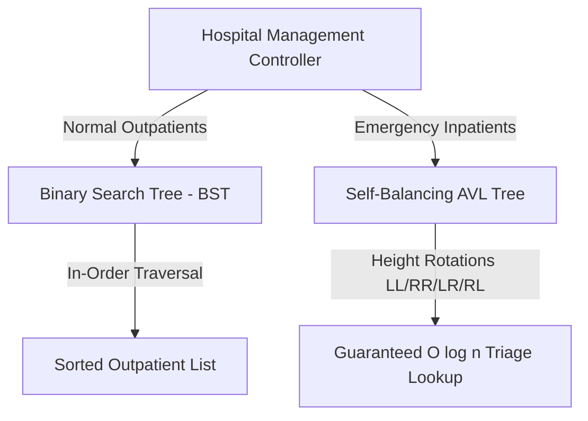

# Hospital Patient Management System (C++ DSA)

[](https://github.com/tahniatfarhan/hospital-patient-management-system-dsa/actions/workflows/ci.yml)
[](https://github.com/tahniatfarhan/hospital-patient-management-system-dsa/actions/workflows/codeql.yml)
[](https://opensource.org/licenses/MIT)
[](https://en.cppreference.com/)
[](https://cmake.org/)

> 🎓 **Academic Project Disclaimer:** This repository is an **educational Data Structures and Algorithms (DSA) project** developed for the Data Structures & Algorithms course in the BS Cyber Security degree program at UET Lahore. It demonstrates a dual-tier storage system utilizing **Binary Search Trees (BST)** for normal outpatient records and **Self-Balancing AVL Trees** for priority emergency ward patient triage.

---

## 📐 System Architecture & Data Structure Design

### Why AVL Trees for Emergency & BST for Normal Outpatients?
In hospital patient management, emergency admissions demand strict $O(\log n)$ performance guarantees for patient lookup, triage sorting, and updates:
- **Emergency Inpatients (AVL Tree):** Uses height-balanced AVL rotations (balance factor $\in \{-1, 0, 1\}$). Self-balancing guarantees $O(\log n)$ worst-case lookup time during critical medical emergencies.
- **Normal Outpatients (BST):** Uses standard Binary Search Tree insertion ($O(\log n)$ average, $O(n)$ worst-case). Ideal for routine appointments where tree balancing overhead is unnecessary.



---

## 📊 Time & Space Complexity Comparison

| Data Structure | Search (Average) | Search (Worst) | Insertion | Deletion | Space Complexity |
|---|---|---|---|---|---|
| **Binary Search Tree (BST)** | $O(\log n)$ | $O(n)$ *(Degenerate Tree)* | $O(\log n)$ | $O(\log n)$ | $O(n)$ |
| **AVL Tree (Self-Balancing)** | $O(\log n)$ | $O(\log n)$ *(Strictly Balanced)* | $O(\log n)$ | $O(\log n)$ | $O(n)$ |
| **Unsorted Linked List** | $O(n)$ | $O(n)$ | $O(1)$ | $O(n)$ | $O(n)$ |

---

## 🔄 AVL Tree Balancing Rotations

```
1. Left-Left (LL) Imbalance ➔ Single Right Rotation
      z                             y
     / \                           / \
    y   T4   Right-Rotate(z)     x   z
   / \       ───────────────>   / \ / \
  x   T3                       T1 T2 T3 T4
 / \
T1 T2

2. Right-Right (RR) Imbalance ➔ Single Left Rotation
    z                               y
   / \                             / \
  T1  y      Left-Rotate(z)       z   x
     / \     ──────────────>     / \ / \
    T2  x                       T1 T2 T3 T4
       / \
      T3 T4
```

---

## 📁 Repository Layout

```
hospital-patient-management-system-dsa/
├── .github/
│   ├── dependabot.yml              # Automated monthly dependency scanner
│   └── workflows/
│       ├── ci.yml                  # CMake GCC/Clang CI test workflow
│       └── codeql.yml              # CodeQL static analysis security scanner
├── docs/                           # Project reports and presentation slides
├── include/                        # C++ Header Files
│   ├── AVLTree.hpp                 # Self-Balancing AVL Tree Implementation
│   ├── BST.hpp                     # Binary Search Tree Implementation
│   └── Patient.hpp                 # Patient Entity Model & Helper Functions
├── src/
│   ├── main.cpp                    # Interactive CLI Terminal Application
│   └── hospital_management.cpp     # Legacy single-file entry point
├── tests/
│   └── test_dsa.cpp                # C++ Unit Tests (Rotations, Deletions, Balance)
├── CMakeLists.txt                  # Modern CMake build manifest
├── CODE_OF_CONDUCT.md              # Contributor Code of Conduct
├── CONTRIBUTING.md                 # Contribution guidelines
├── LICENSE                         # MIT License
├── README.md                       # Documentation & Architecture Overview
└── SECURITY.md                     # Security & RAII Memory Management Policy
```

---

## 🛡️ Memory Safety & Modern C++ Engineering

- **RAII Memory Cleanup:** `BST` and `AVLTree` classes feature post-order recursive destructors (`~BST()`, `~AVLTree()`) to automatically free dynamically allocated nodes (`delete node`), eliminating dynamic memory leaks.
- **Input Stream Protection:** User input routines clear stream error flags (`std::cin.clear()`) and flush invalid characters to prevent numeric menu loops.
- **Strict Compiler Warnings:** `CMakeLists.txt` builds with `-Wall -Wextra -Wpedantic` flags.

---

## 🛠️ Build & Execution Instructions

### 1. Build with CMake
```bash
mkdir build && cd build
cmake ..
make
```

### 2. Run Interactive CLI Application
```bash
./hospital_dsa
```

### 3. Run Automated C++ Unit Test Suite
```bash
./test_dsa
```

---

## 📄 License & Author

Distributed under the **MIT License**. See [`LICENSE`](LICENSE) for details.

**Author:** [Tahniat Farhan](https://github.com/tahniatfarhan) — BS Cyber Security, UET Lahore.
